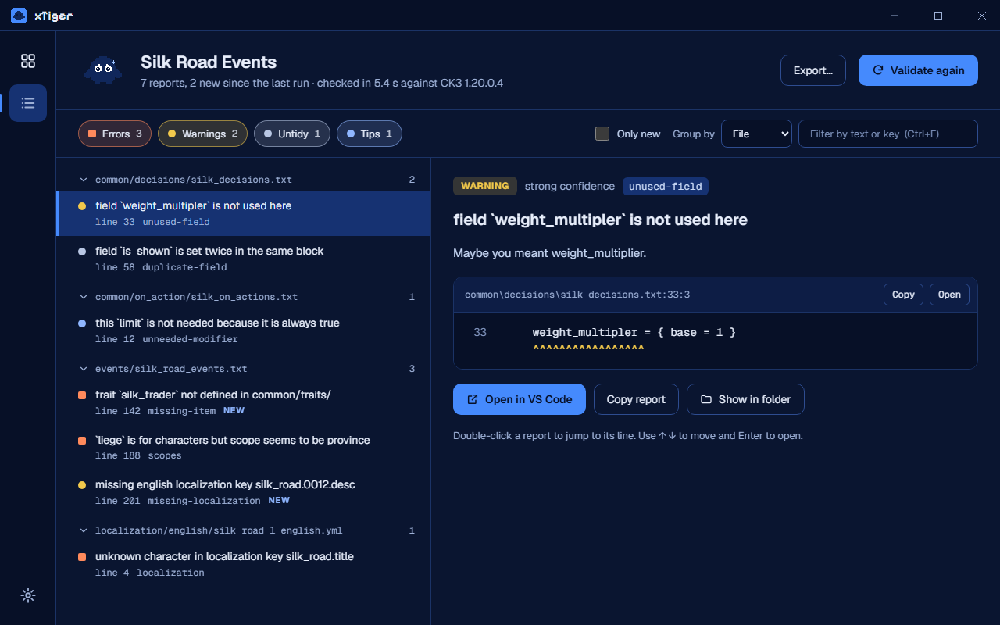
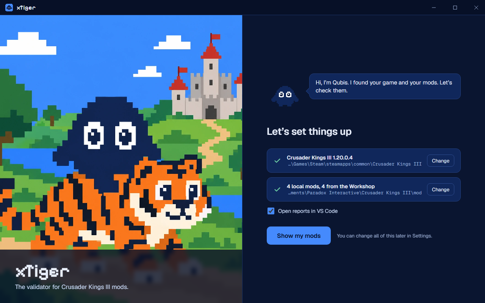
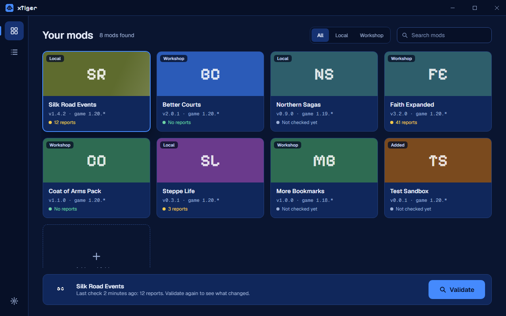

# xTiger


xTiger finds the mistakes in your Crusader Kings III mod before the game does: typos, missing
localization, broken references, effects used in the wrong scope, and a lot more.

It's a fork of [Tiger](https://github.com/amtep/tiger) by amtep, brought up to date for CK3
1.20.0.4. On top of that it adds a desktop app, so you never need a terminal, and a way to let an
AI assistant check and test your mod for you. Qubis, the little reviewer on the right, keeps an eye
on things.

xTiger is for CK3 only. For other Paradox games, use upstream Tiger.

## The app



Download `xTiger_<version>_x64-setup.exe` from the [releases](https://github.com/9mirx0r/xTiger/releases)
and run it. No administrator rights needed. If you'd rather not install anything, grab the portable
zip, unzip it anywhere and run `xTiger.exe`.

- It finds CK3 and all your mods on its own, local and Workshop alike.
- Double-click a mod to check it.
- Reports come grouped by file, kind or severity. You can filter them, or show only what's new
  since your last check.
- Each report shows the broken line, and one click opens it in VS Code.

| First start | Your mods |
|---|---|
|  |  |

## The command line

The release archives also include `ck3-tiger`, the validator itself. On Windows you can simply
double-click `ck3-tiger-auto.exe`: it finds your mods, asks which one to check, and writes a log to
the CK3 `logs` folder. From a terminal:

```bash
ck3-tiger path/to/your_mod/descriptor.mod
```

Add `--game "<CK3 install folder>"` if the game isn't where Steam usually puts it. A few options
worth knowing:

- `--json` prints the reports as JSON.
- `--suppress old.json` hides everything already in an earlier `--json` output, so you only see
  what's new. xTiger gives the same reports for the same files every time, so this stays reliable.
- `--show-vanilla` also reports problems in the base game.

`ck3-tiger --help` lists the rest, and `ck3-tiger update` fetches the latest release.

To choose languages, load parent mods for a submod or silence reports you don't care about, put a
[`ck3-tiger.conf`](ck3-tiger.conf) in your mod folder. See also the [filter guide](filter.md) and
the [annotations guide](annotations.md).

## With an AI assistant

xTiger comes with an MCP server that lets an assistant such as Claude validate your mod, read the
reports, start CK3, type console commands and look at screenshots of the game.

So you can ask for a new event, and the assistant writes it, validates it, fixes what it broke,
fires the event in the game and checks the window looks right. You get back something that works.

To set it up, open the app's Settings and press **Connect** next to Claude Desktop, Claude Code,
Cursor, VS Code or Windsurf. The server finds the game, your mods and the validator on its own. To
set it up by hand, see [`xtiger-mcp/README.md`](xtiger-mcp/README.md).

The assistant can also search the base game's files, look up the game's own docs of triggers
and effects, compare two checks, and test your mod in the game together with a launcher playset.

From the app you can hand work over: **Ask AI to fix** on a report, or **Prepare update report**
on the results of a mod that is behind the game, leaves a request the assistant picks up the next
time you talk to it.

The app's AI activity screen shows what the assistant is doing while it works, why, and what it
found, with one click to the results of each check. The calls are grouped by job, with a chart of
how the reports went down and a summary of what was fixed, what is left and which files changed.

The app and the assistant share one history of checks: when either one checks a mod, what is new
is measured against the last check of that mod, whoever ran it.

## How it differs from Tiger

| | Tiger | xTiger |
|---|---|---|
| CK3 version | 1.19 | 1.20.0.4 |
| Reports on unmodded vanilla | about 144,000 | about 15,000 |
| Same mod, same reports every run | not always | yes |
| Desktop app and AI integration | no | yes |
| Other Paradox games | yes | no |

The vanilla count matters more than it seems: when the base game alone makes thousands of
warnings, the real mistakes in your mod get lost in the noise.

Nothing gets relaxed on a hunch. Before xTiger accepts a field, a small test mod uses it once
correctly and once with a typo, and the game's own `error.log` decides. The real field passes, the
typo is still reported.

It isn't perfect yet. Some triggers and effects new in 1.20 are only partly checked, and fewer
reports doesn't automatically mean more accurate ones. The [changelog](CHANGELOG.md) has the
details.

## Building it yourself

You need Rust (stable).

```bash
git clone https://github.com/9mirx0r/xTiger.git
cd xTiger
cargo build --release -p ck3-tiger -p xtiger-mcp
```

For the app you also need the Tauri CLI (`cargo install tauri-cli --version "^2"`). Then
`xtiger-app/build-release.ps1` builds everything: the validator, the MCP server, the app, the
installer and the portable zip.

## Other tools

These were made for upstream Tiger and work with xTiger too:

- unLomTrois's [VS Code extension](https://github.com/unLomTrois/ck3tiger-for-vscode-2) shows the
  reports in the Problems tab.
- Bahmut's [GitHub Action](https://github.com/kaiser-chris/tiger-action-public) runs the validator
  in your workflows.

## Credits and license

xTiger stands on [Tiger](https://github.com/amtep/tiger) by amtep and its contributors. The
validation engine is their work. This fork updates the CK3 tables and validators and adds the app
and the MCP server. Copyright of the xTiger changes (C) 2026 Qubis and the original copyright
of Tiger stays with its authors. Everything is under the [GNU GPL v3](LICENSE), and the git
history records what changed. The app bundles the fonts Geist, Geist Mono and Pixelify Sans, under the SIL Open
Font License (see [`xtiger-app/ui/fonts`](xtiger-app/ui/fonts)).

If a bug also happens in upstream Tiger, report it there. Anything about CK3 1.20, the app or the
MCP server belongs in this repository's [issues](https://github.com/9mirx0r/xTiger/issues).
