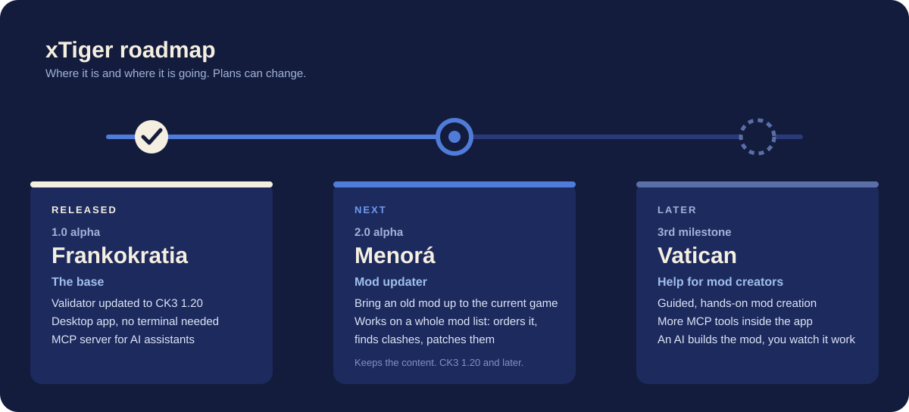

# xTiger roadmap

This is where xTiger is going. It is a direction, not a promise: plans change, and nothing here has
a date.

## 1.0 alpha "Frankokratia" (released)

The base everything else stands on.

- The validator brought up to date for CK3 1.20.
- A desktop app, so you never need a terminal.
- An MCP server, so an AI assistant can check and test your mod.

The [changelog](CHANGELOG.md) has the details.

## 2.0 alpha "Menorá" (next)

A mod updater. Take a mod that was made for an older version of the game, or that its author
stopped updating, and bring it up to the current one.

Say you find a Workshop mod with a great idea that nobody has touched in two years. You give it to
xTiger, and it updates the mod so it runs on the current game without errors, with all of its
features still there.

- **Works on a whole mod list.** If you play with a big, heavy list, xTiger takes the list as a
  whole: it puts the mods in a sensible order, finds the ones that clash with each other or with
  the game, and fixes or patches them.
- **Updates, doesn't cut.** The goal is to keep the mod's content. A fix should not work by removing
  things until the errors go away.
- **CK3 1.20 and later.** Newer versions of the game will bring their own differences, and those
  get handled as they come.
- **It has limits, and says so.** Some changes in the game can't be fixed automatically. When
  xTiger can't fix something safely it will say what and why, and leave it for you or your AI
  assistant instead of guessing.

## "Vatican" (later)

Much more help for the people who make mods.

- **Easier by hand.** Many aids built into the app that make creating a mod by hand more
  intuitive, from the first file to the last check.
- **More tools for an AI assistant.** More MCP tools, so an assistant can connect to the app and
  build a mod with the tools that live inside it, much faster than before.
- **You can watch it work.** You see what the assistant does as it does it, so you can follow
  along, step in, and trust what gets built.

## What comes before all this

Smaller things that are already known and will be done along the way are in the "Known limits"
list of the [changelog](CHANGELOG.md).
